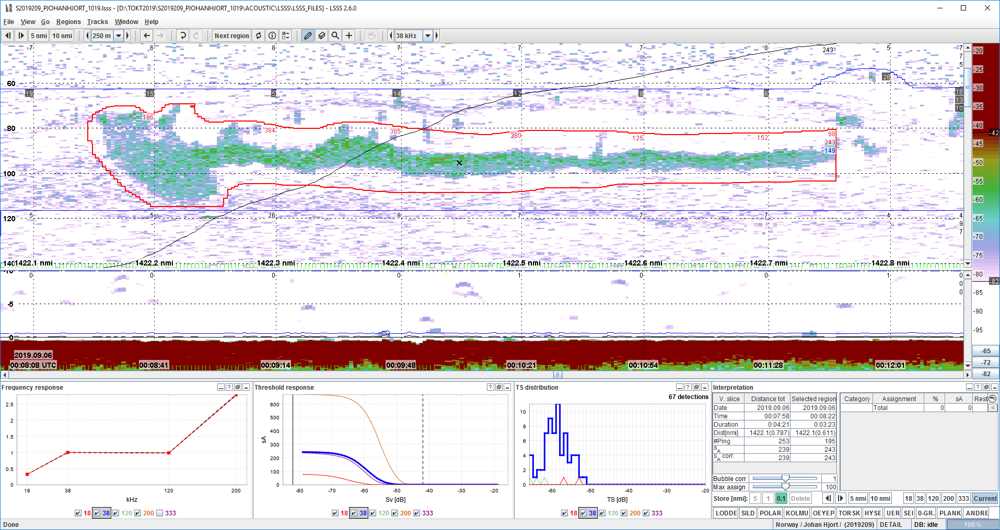

\fontsize{12}{18}
\selectfont

```{r setup, include=FALSE}
knitr::opts_chunk$set(echo = TRUE, dpi = 220, dev = "CairoPNG")
```

```{r install and load packages, echo=FALSE, message=FALSE}
#Load required packages
Packages <- c("data.table", "reshape2", "readxl", "readODS", "worms","Cairo",
              "bookdown", "RstoxData", "maps", "mapdata", "chron","tidyverse")

invisible(lapply(Packages, FUN = function(x) {
    if (!require(x, character.only = TRUE)) {
      install.packages(x, dependencies = TRUE)
      library(x, character.only = TRUE)
    }
  }
))

```

```{r customise report to cruise, echo=FALSE, message=FALSE}

# Directory check - what data has been collected?
ACO <- dir.exists("ACOUSTIC/LSSS/REPORTS")
BIO <- dir.exists("CATCH_MEASUREMENTS/BIOTIC")
CTD <- dir.exists("PHYSICS/CTD/CTD_DATA")

# Define map extent and depth contours
Ylim<-c(70,78.5) # Latitude range
Xlim<-c(8, 38)   # Longitude range
d.contours<-c(-100, -300,-500) #Depth contours for plots with bathymetry

# Define the countries to show in the maps
europe <- map_data("worldHires", c("Norway", "Sweden", "Russia", "Finland")) 

# Select species for distribution maps
species <- c("Mallotus villosus", "Boreogadus saida","Micromesistius poutassou", "Clupea harengus", "Melanogrammus aeglefinus", "Gadus morhua", "Sebastes mentella", "Sebastes norvegicus", "Sebastes viviparus", "Pandalus borealis")

# Set max size of bubbles in species distribution plots
Bubble.size<-6       

# Select metric for catches in species distribution plots (none, one or both)
numplot <- 0 #do you want to plot catches in numbers/nmi?
bioplot <- 1 #do you want to plot catches in kg/nmi?

```

\pagebreak

# Survey description and data availability

\pagebreak

# Cruise tracks and stations

Cruise tracks from the position log with points indicating start positions for different sampling gear. The points are jittered slightly for better visual representation:

```{r, echo=FALSE, message=FALSE, warning=FALSE, fig.width=8, fig.height=6, out.width= "75%", fig.align="center"}

# Get bathymetry data from file
bath1<-read_csv(file = "Data/GeoData/ETOPO1_nm4.csv")

#reduce the resolution of depth contours (to increase speed when writing to file)
bath<-subset(bath1, bath1$y>(Ylim[1]-2) & (bath1$y<Ylim[2]+2) & bath1$ x>(Xlim[1]-2)& bath1$x<(Xlim[2]+2) & bath1$z<=(d.contours[1]+1500) & bath1$z>=(d.contours[length(d.contours)]-1500))

#create a list of the position files from the target directory
file_list <- list.files(path="Data/Track", pattern = ".csv")

#initiate a blank data frame, each iteration of the loop will append the data from the given file to this variable
dataset <- data.frame()

#set temporary working directory
setwd("Data/Track")

for (i in 1:length(file_list)){
  temp_data <- fread(file_list[i], stringsAsFactors = F,header = T, skip = 2,fill = T,strip.white = FALSE) #read in files using the fread function from the data.table package
  #creating a new column that indicates which date each file comes from
  temp_data$Date <- strsplit(gsub(".csv", "", file_list[i]), "s")[[1]][2]
  temp_data$Date <- as.Date(temp_data$Date, format = "%d-%m-%Y")
  #The latitude column is in format "DDMM.MMMM N"
  #The longitude column is in format "0DDMM.MMMM E"
  #Create new columns with lon and lat in decimal degrees
  temp_data <- temp_data %>% separate(Latitude, into = c("DD", "MM", "x1"), 
                                      sep = c(2,9), remove = F) %>% 
    separate(Longitude, into = c("x1.lon", "DD.lon", "MM.lon", "x2.lon"), 
             sep = c(1,3,10), remove = F)
  temp_data$DD <- as.numeric(temp_data$DD)
  temp_data$DD.lon <- as.numeric(temp_data$DD.lon)
  temp_data$MM <- as.numeric(temp_data$MM)
  temp_data$MM.lon <- as.numeric(temp_data$MM.lon)
  temp_data$Lat.dd <- temp_data$DD + temp_data$MM/60
  temp_data$Lon.dd <- temp_data$DD.lon + temp_data$MM.lon/60
  
  temp_data <-  temp_data %>% dplyr::rename(gear.text = `Station type`)
  
  #for each iteration, bind the new data to the building dataset
  dataset <- rbindlist(list(dataset, temp_data), use.names = T, fill = T) 
  #arrange after date
  dataset  <- dataset %>% arrange(Date)
  rm(temp_data)
  }

#Plot the cruise tracks and stations
ggplot(bath, aes(x=x, y=y))+
  geom_contour(aes(z=z), breaks=d.contours,colour="lightblue", size=0.5,show.legend = TRUE)+ 
  geom_map(data=europe, map=europe,  aes(x=long, y=lat, map_id=region),
           color="gray50", fill="gray60")+
  geom_point(data=dataset, aes(Lon.dd, Lat.dd, group = Date), alpha=0.25, colour="grey45", size=0.05, inherit.aes = F)+
  geom_jitter(data = dataset %>% dplyr::filter(!gear.text == "  -->" &
                                                !grepl("stop",gear.text)), 
             aes(Lon.dd, Lat.dd, shape=gear.text), size = 2, 
             inherit.aes = F, width = 0.1)+
  scale_color_viridis_d(na.translate=F)+
  theme_bw()+
  coord_map(xlim = Xlim,ylim = Ylim)+
  labs(x = "Longitude", y = "Latitude", color="Sampling gear")

```
\pagebreak
```{r read in biotic data, echo = FALSE, message=FALSE, warning = FALSE, results='hide'}
#specify file path
tokt <- paste0("Data/Biotic/",list.files(path="Data/Biotic", pattern = ".xml"))

#read in with function ReadBiotic from RstoxData
dd<- ReadBiotic(tokt)

#Combine station and catch data
stasamp <- right_join(dd[[1]]$fishstation,dd[[1]]$catchsample) %>% mutate(cr.kg.nm=catchweight/distance) %>% mutate(cr.n.nm=catchcount/distance)

# Add scientific species names (code from Ibrahim Umar)

# Source Edvin Fugleback's script for translating species names from aphia codes
source("https://github.com/Sea2Data/cruisetools/raw/master/taxaAnnotation/annotateTaxa.R")

# Get taxa taxaTable
## Get list of aphias
aphias <- unlist(unique(stasamp$aphia[!is.na(stasamp$aphia)])) 
## Make taxa table 
taxaTable <- makeTaxaTable(aphias)

# Merge with NMD biotic data - removing scientificname column in stasamp data (NA values)
stasamp <- left_join(stasamp[,-"scientificname"], 
                     taxaTable %>% select(AphiaID,scientificname),
                     by=c("aphia"="AphiaID"))

#Legg til geartype i tekstformat
stasamp$gear.text <- NA
stasamp$gear.text[grepl("^30",stasamp$gear)] <- "Bottom trawl"
stasamp$gear.text[grepl("^31",stasamp$gear)] <- "Bottom trawl"
stasamp$gear.text[grepl("^32",stasamp$gear)] <- "Bottom trawl"
stasamp$gear.text[grepl("^34",stasamp$gear)] <- "Unspecified trawl"
stasamp$gear.text[grepl("^35",stasamp$gear)] <- "Pelagic trawl"
stasamp$gear.text[grepl("^36",stasamp$gear)] <- "Danish seine"
stasamp$gear.text[grepl("^37",stasamp$gear)] <- "Seine"
stasamp$gear.text[grepl("^40",stasamp$gear)] <- "Gill net"
stasamp$gear.text[grepl("^41",stasamp$gear)] <- "Gill net"

```

## Trawl sampling effort

`r length(unique(stasamp$station))` trawl hauls were taken during the survey, of which `r length(unique(stasamp$station[stasamp$gear.text == "Bottom trawl" & stasamp$samplequality != 2]))` were bottom trawl, `r length(unique(stasamp$station[stasamp$gear.text == "Pelagic trawl" & stasamp$samplequality != 2]))` pelagic trawl, and `r length(unique(stasamp$station[stasamp$samplequality == 2]))` were trawling on registration. The trawl hauls covered a total distance of `r round((sum(dd[[1]]$fishstation$distance)*1852)/1000, digits = 1)` km (`r round((sum(dd[[1]]$fishstation$distance)), digits = 1)` nmi).  
  
The sampling stations were located in areas with bottom depths from `r round(min((stasamp$bottomdepthstart+stasamp$bottomdepthstop)/2), digits =1)` m to `r round(max((stasamp$bottomdepthstart+stasamp$bottomdepthstop)/2), digits = 1)` m, and the fishing depth varied from `r round(min((stasamp$fishingdepthmin+stasamp$fishingdepthmax)/2), digits=1)` m to `r round(max((stasamp$fishingdepthmin+stasamp$fishingdepthmax)/2), digits=1)` m.

### Mean bottom depth during trawl hauls
```{r, echo=FALSE, message=FALSE, fig.width=6, fig.height=2.5, out.width= "70%"}
## Depth at sampled stations - fish
stdat <- stasamp %>% select(serialnumber, station, stationstarttime, longitudestart,
                            latitudestart, bottomdepthstart, bottomdepthstop,
                            fishingdepthmin, fishingdepthmax, gear.text)
#Bottom depth
ggplot(stdat, aes((bottomdepthstart+bottomdepthstop)/2))+
  geom_histogram(color="black", position = "dodge")+
  labs(x= "Mean bottom depth during trawl haul (m)", y = "Number")+
  facet_wrap(~gear.text)+theme_bw()+
  scale_y_continuous(breaks = c(0,2,4,6,8,10,12))
```

### Mean fishing depth during trawl hauls (excluding pelagic hauls)
```{r, echo=FALSE, message=FALSE, fig.width=6, fig.height=3, out.width= "65%"}
#Fishing depth
ggplot(stdat %>% dplyr::filter(!gear.text == "Pelagic trawl"), aes((fishingdepthmin+fishingdepthmax)/2, fill = gear.text))+
  geom_histogram(color="black")+
  labs(x= "Mean fishing depth during trawl haul (m)", y = "Number")+
  scale_fill_viridis_d(name = "Gear")+theme_bw()
```

\pagebreak

# Catch composition

## Species diversity

```{r,echo=FALSE, message=FALSE}
#Sjekk hvilke arter som er vanligst
options(dplyr.summarise.inform=F)
tst<-stasamp %>% dplyr::group_by(scientificname) %>% 
  dplyr::summarise(meanW=mean(cr.kg.nm), meanN = mean(cr.n.nm),
                   minW = min(cr.kg.nm), maxW = max(cr.kg.nm),
                   minN = min(cr.n.nm), maxN = max(cr.n.nm))
```

A total of `r length(unique(tst$scientificname))` species were registered in the Sea2Data database during the survey.

```{r, echo = FALSE, message=FALSE, fig.width=6, fig.height=3.5, out.width= "70%"}
#cumulative number of species vs number of stations
nspec <- data.frame(station=unique(stasamp$station),
           nspecies=tapply(cumsum(!duplicated(stasamp$scientificname)), stasamp$station,max))

nspec$nstation <- seq(1:nrow(nspec))

ggplot(nspec, aes(nstation, nspecies))+geom_line(size = 1)+theme_bw()+
  labs(x = "Number of stations sampled", y = "Number of unique species identified",
       title = "Number of species identified versus number of stations sampled")
```

\pagebreak

## Max catch rate by species for the 20 species with highest catch rates

### Bottom trawl

```{r,echo=FALSE, message=FALSE, fig.width=9, fig.height=3.3, out.width= "85%", fig.align="center", warning=FALSE}
options(dplyr.summarise.inform=F)
tst<-subset(stasamp, gearcondition==1) %>% 
  dplyr::group_by(gear.text,scientificname) %>% 
  dplyr::summarise(meanW=mean(cr.kg.nm), meanN = mean(cr.n.nm),
                   minW = min(cr.kg.nm), maxW = max(cr.kg.nm),
                   minN = min(cr.n.nm), maxN = max(cr.n.nm))
```

The species with highest catch rates in bottom trawls were `r g<-tst %>% filter(gear.text == "Bottom trawl") %>% arrange(-maxW);g[1,2]` (`r unique(stasamp$commonname[stasamp$scientificname %in% toString(g[1,2])])`) by biomass, and `r g<-tst %>% filter(gear.text == "Bottom trawl") %>% arrange(-maxN);g[1,2]` (`r unique(stasamp$commonname[stasamp$scientificname %in% toString(g[1,2])])`) by number.

```{r, echo=FALSE, message=FALSE, fig.width=9, fig.height=3.3, out.width= "85%", fig.align="center", warning=FALSE}
gear <- "Bottom trawl"

#Weight
ggplot(tst %>% dplyr::filter(gear.text == gear & !is.na(scientificname)),
       aes(reorder(scientificname, -maxW), maxW))+geom_col()+
  coord_cartesian(xlim =c(1,20))+ #show the 20 species with highest catches
  scale_y_continuous(expand=c(0,0), limits = c(0,max(tst$maxW[tst$gear.text==gear], na.rm=T)+2))+theme_bw()+
  theme(axis.text.x = element_text(angle = 35, colour = "red", size = 11),
        axis.title.x = element_blank())+
  labs(x = "Taxon", y = "Max catch rate (kg/nmi)", title = "Biomass")

#Number
ggplot(tst %>% dplyr::filter(gear.text == gear & !is.na(scientificname)),
       aes(reorder(scientificname, -maxN), maxN))+geom_col()+
  coord_cartesian(xlim =c(1,20))+ #show the 20 species with highest catches
  scale_y_continuous(expand=c(0,0), limits = c(0,max(tst$maxN[tst$gear.text==gear], na.rm=T)+15))+#, limits = c(0,700))+
  theme_bw()+theme(axis.text.x = element_text(angle = 35, colour = "red", size = 11), axis.title.x = element_blank())+
  labs(x = "Taxon", y = "Max catch rate (N/nmi)", title = "Number of individuals")

```

### Pelagic trawl

The species with highest catch rates in pelagic trawls were `r g<-tst %>% filter(gear.text == "Pelagic trawl") %>% arrange(-maxW);g[1,2]` (`r unique(stasamp$commonname[stasamp$scientificname %in% toString(g[1,2])])`) by biomass, and `r g<-tst %>% filter(gear.text == "Pelagic trawl") %>% arrange(-maxN);g[1,2]` (`r unique(stasamp$commonname[stasamp$scientificname %in% toString(g[1,2])])`) by number.

```{r, echo=FALSE, message=FALSE, fig.width=9, fig.height=3.3, out.width= "85%", fig.align="center", warning=FALSE}
gear <- "Pelagic trawl"

#Weight
ggplot(tst %>% dplyr::filter(gear.text == gear & !is.na(scientificname)),
       aes(reorder(scientificname, -maxW), maxW))+geom_col()+
  coord_cartesian(xlim =c(1,20))+ #show the 20 species with highest catches
  scale_y_continuous(expand=c(0,0), limits = c(0,max(tst$maxW[tst$gear.text==gear], na.rm=T)+2))+theme_bw()+
  theme(axis.text.x = element_text(angle = 35, colour = "red", size = 11),
        axis.title.x = element_blank())+
  labs(x = "Taxon", y = "Max catch rate (kg/nmi)", title = "Biomass")

#Number
ggplot(tst %>% dplyr::filter(gear.text == gear & !is.na(scientificname)),
       aes(reorder(scientificname, -maxN), maxN))+geom_col()+
  coord_cartesian(xlim =c(1,20))+ #show the 20 species with highest catches
  scale_y_continuous(expand=c(0,0), limits = c(0,max(tst$maxN[tst$gear.text==gear], na.rm=T)+15))+#, limits = c(0,700))+
  theme_bw()+theme(axis.text.x = element_text(angle = 35, colour = "red", size = 11), axis.title.x = element_blank())+
  labs(x = "Taxon", y = "Max catch rate (N/nmi)", title = "Number of individuals")
```

## Spatial variation in catches of common species

```{r create space between plots, echo=FALSE, message=FALSE}
my_plot_hook <- function(x, options)
  paste("\n", knitr::hook_plot_tex(x, options), "\n")
knitr::knit_hooks$set(plot = my_plot_hook)
```

```{r spatial distribution of catches, echo=FALSE, message=FALSE, warning=FALSE, fig.width = 9, fig.height = 3, out.width="90%", fig.align="left"}
#Get coordinates for ship track
coord.track <- dataset %>% dplyr::select(Date,Log, Lon.dd, Lat.dd) %>% data.frame()

for(i in 1:length(species)) {
  if (numplot == 1) {
    Title = paste("Catch rate (number of individuals)", "|", toString(format(Sys.Date(), "%Y")),
                  "|", toString(species[i]))
    g <- ggplot(bath, aes(x = x, y = y)) +
      geom_contour(
        aes(z = z),
        breaks = d.contours,
        colour = "lightblue",
        size = 0.5,
        show.legend = TRUE
      ) +
      geom_map(data=europe, map=europe,  aes(x=long, y=lat, map_id=region),
           color="gray50", fill="gray60")+
      geom_point(
        data = coord.track,
        aes(Lon.dd, Lat.dd, group = Date),
        alpha = 0.1,
        colour = "grey65",
        size = 0.1,
        inherit.aes = F
      ) +
      geom_point(
        data = stasamp %>% dplyr::filter(scientificname == species[i]),
        aes(longitudestart, latitudestart, size = cr.n.nm),
        shape = 21,
        alpha = 0.7,
        colour = "black",
        fill = "orange",
        stroke = .2
      ) +
      facet_grid( ~ gear.text) +
      scale_size_area(max_size = Bubble.size) +
      theme_bw() +
      coord_map(xlim = Xlim, ylim = Ylim) +
      labs(
        x = NULL,
        y = NULL,
        size = "Catch rate (N/nmi)",
        title = Title
      )
    print(g)
    
  }
  if (bioplot == 1) {
    Title = paste("Catch rate (biomass)", "|", toString(format(Sys.Date(), "%Y")),
                  "|", toString(species[i]))
    #Catch rate kg/nmi
    h <- ggplot(bath, aes(x = x, y = y)) +
      geom_contour(
        aes(z = z),
        breaks = d.contours,
        colour = "lightblue",
        size = 0.5,
        show.legend = TRUE
      ) +
      geom_map(data=europe, map=europe,  aes(x=long, y=lat, map_id=region),
           color="gray50", fill="gray60")+
      geom_point(
        data = coord.track,
        aes(Lon.dd, Lat.dd, group = Date),
        alpha = 0.1,
        colour = "grey65",
        size = 0.1,
        inherit.aes = F
      ) +
      geom_point(
        data = stasamp %>% dplyr::filter(scientificname == species[i]),
        aes(longitudestart, latitudestart, size = cr.kg.nm),
        shape = 21,
        alpha = 0.7,
        colour = "black",
        fill = "orange",
        stroke = .2
      ) +
      facet_grid( ~ gear.text) +
      scale_size_area(max_size = Bubble.size) +
      theme_bw() +
      coord_map(xlim = Xlim, ylim = Ylim) +
      labs(
        x = NULL,
        y = NULL,
        size = "Catch rate (kg/nmi)",
        title = Title
      )
    print(h)
  }
}
```
\pagebreak

## Length-weight relationships - all species

```{r, echo=FALSE, message=FALSE, fig.width=9, fig.height=6, out.width= "90%", warning=FALSE}
stasampindi <- right_join(stasamp,dd[[1]]$individual)
stasampindiage <- left_join(stasampindi, dd[[1]]$agedetermination)

#m -> cm
stasampindiage$length.cm <- (stasampindiage$length * 100 )

#create list of unique species
species <- stasampindiage %>% dplyr::filter(individualweight > 0 & !is.na(scientificname)) %>% dplyr::select(scientificname) %>% unique() %>% 
  arrange(scientificname) %>% data.frame()

# split the species into 2 or 3 plots depending on the number of unique species
# that has individual weights
if(nrow(species) <= 50){
  
  ggplot(stasampindiage %>% filter(individualweight>0 & scientificname %in% species$scientificname[1:floor((nrow(species)/2))] & !is.na(scientificname)),
         aes(x=length.cm, y=individualweight, group=scientificname)) +
    geom_point(size=3, shape="+", aes(colour=scientificname)) +guides(colour=FALSE)+
    facet_wrap(~scientificname, scales="free") + 
    labs(x="Length (cm)", y="Weight (kg)")+ theme_bw()
  
  ggplot(stasampindiage %>% filter(individualweight>0 & scientificname %in% species$scientificname[(floor((nrow(species)/2))+1):nrow(species)] & !is.na(scientificname)), 
         aes(x=length.cm, y=individualweight, group=scientificname)) +
    geom_point(size=3, shape="+", aes(colour=scientificname)) +guides(colour=FALSE)+
    facet_wrap(~scientificname, scales="free") + 
    labs(x="Length (cm)", y="Weight (kg)")+ theme_bw()

} else{
  ggplot(stasampindiage %>% filter(individualweight>0 & scientificname %in% species$scientificname[1:floor((nrow(species)/3))] & !is.na(scientificname)),
         aes(x=length.cm, y=individualweight, group=scientificname))+
    geom_point(size=3, shape="+", aes(colour=scientificname)) +guides(colour=FALSE)+
    facet_wrap(~scientificname, scales="free") + 
    labs(x="Length (cm)", y="Weight (kg)")+ theme_bw()
  
    ggplot(stasampindiage %>% filter(individualweight>0 & scientificname %in% species$scientificname[(floor((nrow(species)/3))+1):(floor((nrow(species)/3)*2))] & !is.na(scientificname)),
         aes(x=length.cm, y=individualweight, group=scientificname))+
    geom_point(size=3, shape="+", aes(colour=scientificname)) +guides(colour=FALSE)+
    facet_wrap(~scientificname, scales="free") + 
    labs(x="Length (cm)", y="Weight (kg)")+ theme_bw()

ggplot(stasampindiage %>% filter(individualweight>0 & scientificname %in% species$scientificname[(floor((nrow(species)/3)*2)+1):nrow(species)] & !is.na(scientificname)), 
       aes(x=length.cm, y=individualweight, group=scientificname)) +
  geom_point(size=3, shape="+", aes(colour=scientificname))+ guides(colour=FALSE) +
  facet_wrap(~scientificname, scales="free") + 
  labs(x="Length (cm)", y="Weight (kg)")+ theme_bw() 

}
```

\pagebreak

## Length-age relationships

```{r, echo=FALSE, message=FALSE, fig.width=8, fig.height=5, out.width= "80%", warning=FALSE}
ggplot(stasampindiage %>% filter(age>0 & !is.na(scientificname)), aes(length.cm, age))+geom_point(size = 0.5)+facet_wrap(~scientificname, scales = "free")+
  theme_bw()+labs(x = "Length (cm)", y = "Age (years)")
```

\pagebreak

# Acoustic registrations

```{r, echo=FALSE, message=FALSE, warning=FALSE}
### Get acoustic data

#Read in depth-integrated acoustic data from the Acoustic/Integrated directory
dat <- paste0("Data/Acoustic/Integrated/",list.files(path="Data/Acoustic/Integrated", pattern = ".txt"))

acu.dat<-read.csv(dat, header=T)

#Prepare file
acu.year<-as.numeric(substr(acu.dat$DATE,1,5))
acu.dat<- dplyr::select(acu.dat,SHIP,NATION,SURVEY,FREQUENCY,TR,DATE,TIME,LOGSTART,LOGSTOP,LONGITUDE,LATITUDE,DEPTH, c(13:ncol(acu.dat)))
acu.dat<-cbind(acu.dat,acu.year)
acu.dat<-plyr::rename(acu.dat,replace = c("acu.year"="YEAR"))

```

A total of `r (round((sum(acu.dat$LOGSTOP[acu.dat$LOGSTOP>5000]-acu.dat$LOGSTART[acu.dat$LOGSTOP>5000]) + sum(acu.dat$LOGSTOP[acu.dat$LOGSTOP<=5000]-acu.dat$LOGSTART[acu.dat$LOGSTOP<=5000])), digits = 1)*1852)/1000` km (`r round(sum(acu.dat$LOGSTOP[acu.dat$LOGSTOP>5000]-acu.dat$LOGSTART[acu.dat$LOGSTOP>5000]) + sum(acu.dat$LOGSTOP[acu.dat$LOGSTOP<=5000]-acu.dat$LOGSTART[acu.dat$LOGSTOP<=5000]), digits = 1)` nmi ) of acoustic transects were scrutinized.

## Example echograms

<!-- {width=8in} -->

<!-- Screenshot from Johan Hjort showing a confirmed capelin school with unusal frequency response, likely caused by emptying of the swim bladder. 06.09.2019, Barents Sea ecosystem survey. Position approximately 76 32 N, 01741 E. LSSS v. 2.6.0. -->

## Depth-integrated acoustic backscatter

### Total backscatter

```{r, echo=FALSE, message=FALSE, fig.width=5, fig.height=4, out.width= "50%", warning=FALSE}
### Map area etc
Bubble.size<-9        #Max size of bubbles in bubble plots

### Selection variables
Year <- 2019 
#format(Sys.time(), "%Y")
Frequency<-c(38000)         #c(3800,120000) c(120000)  - NULL=all frequencies

#Select all species, and the total, and the 38 kHz frequency (in case there are other frequencies in the file)
acu.dat.spec<- select(acu.dat,YEAR,FREQUENCY,LONGITUDE,LATITUDE, c(13:ncol(acu.dat)))    
if(is.null(Year)==FALSE)
  acu.dat.map<-acu.dat.spec %>% filter(YEAR%in%Year)
if(is.null(Frequency)==FALSE)
  acu.dat.map<-acu.dat.map %>% filter(FREQUENCY %in% Frequency)

#Melt data so we can plot all acoustic categories in one figure with ggplot
acu.dat.map.melt <- reshape2::melt(acu.dat.map, id.vars = c(1:4))

#Change the names of acoustic categories
labls <- c("Other", "Plankton","Polar cod","Herring", "Capelin","0-group",
          "Saithe", "Blue whiting", "Norway pout", "Redfish","Haddock",
          "Cod", "Total")

acu.dat.map.melt$variable <- factor(acu.dat.map.melt$variable, 
                                    levels = c(paste(names(acu.dat.map)[5:ncol(acu.dat.map)])),
                                    labels = labls)

# Plot title 
Yr <- sort(unique(acu.dat.map$YEAR))
Fr <- sort(unique(acu.dat.map$FREQUENCY))/1000
Title <- paste("Ecosystem survey Johan Hjort","|",toString(Yr),"|",toString(Fr),"kHz")

#Plot total acoustic backscatter
ggplot(bath, aes(x=x, y=y))+
  geom_contour(aes(z=z), breaks=d.contours,colour="lightblue", size=0.5,show.legend = TRUE)+ 
  geom_map(data=europe, map=europe,  aes(x=long, y=lat, map_id=region),
           color="gray50", fill="gray60")+  
  geom_point(data=acu.dat.map.melt %>% dplyr::filter(variable == "Total"),
             aes(LONGITUDE,LATITUDE,size = value),shape=21, alpha = 0.3, colour = "black",fill="orange",stroke = .2)+
  facet_wrap(~variable)+
  geom_path(data=acu.dat.map.melt  %>% dplyr::filter(variable == "Total"),aes(LONGITUDE,LATITUDE), linejoin="round",lineend="square",alpha=0.4,colour="black",size=0.4)+
  scale_size_area(max_size=Bubble.size)+
  theme_bw()+
  coord_map(xlim = Xlim,ylim = Ylim)+
  labs(x = NULL, y = NULL, size = "Sa - values", title=Title)
```

\pagebreak

### Pelagic species

```{r, echo=FALSE, message=FALSE, fig.width=9, fig.height=6, out.width= "90%", warning=FALSE, fig.align="center"}
# Plot
pelagics <- c("Plankton","Polar cod","Herring","Capelin","0-group","Blue whiting")

ggplot(bath, aes(x=x, y=y))+
  geom_contour(aes(z=z), breaks=d.contours,colour="lightblue", size=0.5,show.legend = TRUE)+
  geom_map(data=europe, map=europe,  aes(x=long, y=lat, map_id=region),
           color="gray50", fill="gray60")+
  geom_point(data=acu.dat.map.melt %>% dplyr::filter(variable %in% pelagics),
             aes(LONGITUDE,LATITUDE,size = value),shape=21, alpha = 0.3, colour = "black",fill="orange",stroke = .2)+
  facet_wrap(~variable)+
  geom_path(data=acu.dat.map.melt  %>% dplyr::filter(variable %in% pelagics),
            aes(LONGITUDE,LATITUDE), linejoin="round",lineend="square",alpha=0.4,colour="black",size=0.4)+
  scale_size_area(max_size=Bubble.size)+
  theme_bw()+
  coord_map(xlim = Xlim,ylim = Ylim)+
  labs(x = NULL, y = NULL, size = "Sa - values", title=Title)
```

### Demersal species

```{r, echo=FALSE, message=FALSE, fig.width=9, fig.height=6, out.width= "90%", warning=FALSE, fig.align="center"}

demersals <- c("Saithe", "Norway pout", "Redfish","Haddock","Cod")

ggplot(bath, aes(x=x, y=y))+
  geom_contour(aes(z=z), breaks=d.contours,colour="lightblue", size=0.5,show.legend = TRUE)+
  geom_map(data=europe, map=europe,  aes(x=long, y=lat, map_id=region),
           color="gray50", fill="gray60")+
  geom_point(data=acu.dat.map.melt %>% dplyr::filter(variable %in% demersals),
             aes(LONGITUDE,LATITUDE,size = value),shape=21, alpha = 0.3, colour = "black",fill="orange",stroke = .2)+
  facet_wrap(~variable)+
  geom_path(data=acu.dat.map.melt %>% dplyr::filter(variable %in% demersals),
            aes(LONGITUDE,LATITUDE), linejoin="round",lineend="square",alpha=0.4,colour="black",size=0.4)+
  scale_size_area(max_size=Bubble.size)+
  theme_bw()+
  coord_map(xlim = Xlim,ylim = Ylim)+
  labs(x = NULL, y = NULL, size = "Sa - values", title=Title)

```

## Acoustic backscatter in depth channels

### Distance from the surface to weighted depth of acoustic registrations
```{r, echo=FALSE, message=FALSE, fig.width=9, fig.height=6, out.width= "90%", warning=FALSE, fig.align="center"}

#### SA resolved in depth channels, plot day night distribution of SA for each species
#in a histogram

#Read in depth-integrated acoustic data from the Acoustic/Integrated directory
dat <- paste0("Data/Acoustic/Channels/",list.files(path="Data/Acoustic/Channels", pattern = ".txt"))

acu.ch<-read.table(dat, header=T)

## calculate solar elevation angle for each point

#split time variable into hour, min, sec
times <- colsplit(acu.ch$UTC, pattern = c(":"), names = c("hour", "min", "sec"))
acu.ch.sun <- cbind(acu.ch, times)
acu.ch.sun$hour <- as.numeric(acu.ch.sun$hour)
acu.ch.sun$min <- as.numeric(acu.ch.sun$min)
acu.ch.sun$sec <- as.numeric(acu.ch.sun$min)

#function for calculating solar elevation angle from geographical position and time of day
alt.of.sun <- function(min=x$min, hour=x$hour, day=x$DA, month=x$MO, 
                       lat=x$LATITUDE, lon=x$LONGITUD){
  # altitude of sun
  UTC <- hour + min/60
  CET <- (UTC + 1) %% 24
  dayadd <- cumsum(c(0,31,28,31,30,31,30,31,31,30,31,30,31))
  cumday <- day + dayadd[month]
  K1 <- (lon - 15 - 0.4083 * sin(0.0172 * (cumday-80)) 
         - 1.7958 * cos(0.0172 * (cumday-80))
         + 2.4875 * sin(0.0344 * (cumday-80)))
  SST <- ((CET*15) + K1) / (180/pi)
  dkl <- asin(0.3979 * sin((0.0172 * (cumday - 80))
                           + 0.03346 * (sin(0.0172 * cumday) - 0.98112)))
  Brq <- lat/(180/pi)
  sinush <- (sin(dkl)*sin(Brq)) - (cos(dkl)*cos(Brq)*cos(SST))
  alt.of.sun <- asin(sinush) * (180/pi)
  
  # time when altitude of sun = asun.0
  asun.0 <- 0
  K2 <- (sin(dkl)*sin(Brq) - sin(asun.0/(180/pi))) / (cos(dkl)*cos(Brq))
  K2[K2 < (-1)] <- -1        # polar night
  K2[K2 > ( 1)] <-  1         # midnight sun
  SST0 <- acos(K2)
  CET0 <- (SST0 * (180/pi) - K1) / 15
  UTC0 <- (CET0 - 1) + 24*(CET0 < 1)
  sun.rise <- UTC0%%24
  sun <- data.frame(month, day, hour, min, lon, lat,
                    alt.of.sun, sun.rise)
  return(sun)
}

#do the calculation
x <- acu.ch.sun
sun <- alt.of.sun()
acu.ch.sun <- cbind(acu.ch.sun, sunheight = sun$alt.of.sun, sunrise = sun$sun.rise)

#define day/night observations
acu.ch.sun$TOD <- "Night"
acu.ch.sun$TOD[acu.ch.sun$sunheight-acu.ch.sun$sunrise>0] <- "Day"

#reshape data to long format for plotting
acu.ch.melt <- melt(acu.ch.sun, id.vars = c(1:16,(ncol(acu.ch)+1):ncol(acu.ch.sun)))

#calculate mean depths weighted by SA for each position and category
acu.wmean <- acu.ch.melt %>% dplyr::group_by(LONGITUD, LATITUDE,TOD,BDMIN, BDMAX, 
                                      corr.sun = sunheight-sunrise,variable) %>% 
  dplyr::summarise(wdepth = weighted.mean(PDMEAN, w = value)) %>% data.frame()

#change category names
acu.wmean$variable <- factor(acu.wmean$variable, 
                                    levels = c(paste(names(acu.ch)[17:ncol(acu.ch)])),
                                    labels = labls)

#Here is code for two different plots; 
#1) the depth of acoustic registrations - most relevant for species with diel vertical migration, where the light level is proportional to the depth they occupy
#2) the distance of acoustic registrations to the seafloor, or in cases when the bottom depth is > 600 m, the distance to the maximum scrutinized depth - may be relevant for looking at the depth distribution of demersal species

#Plot histogram of weighted depth of acoustic regitrations by time of day and acoustic category

#pelagic species
ggplot(acu.wmean %>% dplyr::filter(variable %in% pelagics),
       aes(wdepth))+geom_histogram(aes(fill=TOD), position="dodge", binwidth = 20)+
  facet_wrap(~variable)+ coord_flip()+scale_x_continuous(limits=c(0,max(acu.wmean$wdepth, na.rm=T)+20))+
  scale_x_reverse()+
  scale_fill_viridis_d(name="Time of day", direction = -1)+theme_bw()+
  labs(y = "Number of observations (scrutinized nmi)", 
       x = "Weighted depth of acoustic backscatter (m)", title = "Pelagic species")
```

\pagebreak

```{r, echo=FALSE, message=FALSE, fig.width=9, fig.height=6, out.width= "90%", warning=FALSE, fig.align="center"}
#demersals
ggplot(acu.wmean %>% dplyr::filter(variable %in% demersals),
       aes(wdepth))+geom_histogram(aes(fill=TOD), position="dodge", binwidth = 20)+
  facet_wrap(~variable)+ coord_flip()+scale_x_continuous(limits=c(0,max(acu.wmean$wdepth, na.rm=T)+20))+
  scale_x_reverse()+
  scale_fill_viridis_d(name="Time of day", direction = -1)+theme_bw()+
  labs(y = "Number of observations (scrutinized nmi)", 
       x = "Weighted depth of acoustic backscatter (m)", title = "Demersal species")
```

\pagebreak

### Distance from the seafloor (or max scrutinized depth) to weighted depth of acoustic registrations

```{r, echo=FALSE, message=FALSE, fig.width=9, fig.height=6, out.width= "90%", warning=FALSE, fig.align="center"}
ggplot(acu.wmean %>% dplyr::filter(variable %in% pelagics),
       aes(BDMAX-wdepth))+
  geom_histogram(aes(fill=TOD), position="dodge", binwidth = 20)+ 
  facet_wrap(~variable) + coord_flip() +
  scale_x_continuous(limits=c(0,max(acu.wmean$BDMAX-acu.wmean$wdepth, na.rm=T)+20)) +
  scale_fill_viridis_d(name="Time of day", direction = -1) + theme_bw()+
  labs(y = "Number of observations (scrutinized nmi)", 
       x = "Distance to max scutinized depth (m)", title = "Pelagic species")
```

\pagebreak
```{r, echo=FALSE, message=FALSE, fig.width=9, fig.height=6, out.width= "90%", warning=FALSE, fig.align="center"}
ggplot(acu.wmean %>% dplyr::filter(variable %in% demersals),
       aes(BDMAX-wdepth))+
  geom_histogram(aes(fill=TOD), position="dodge", binwidth = 20)+ 
  facet_wrap(~variable) + coord_flip() +
  scale_x_continuous(limits=c(0,max(acu.wmean$BDMAX-acu.wmean$wdepth, na.rm=T)+20)) +
  scale_fill_viridis_d(name="Time of day", direction = -1) + theme_bw()+
  labs(y = "Number of observations (scrutinized nmi)", 
       x = "Distance to max scutinized depth (m)", title = "Demersal species")
```

\pagebreak

# CTD
```{r, echo=FALSE, message=FALSE}

#create a list of the files from your target directory
file_list <- list.files(path="Data/CTD",  pattern = ".cnv")

#set temporary working directory
setwd("Data/CTD")

#initiate a blank data frame, each iteration of the loop will append the data from the given file to this variable
ctd <- data.frame()

for (i in 1:length(file_list)){
  temp_data <- fread(file_list[i], stringsAsFactors = F,header = F, skip = 320) #read in files using the fread function from the data.table package
  names(temp_data) <- c("scan_count", "pressure_db", "temperature", "temperature_2", 
                   "conductivity", "conductivity_2", "oxygen_raw", "altimeter", 
                   "par_irradiance", "surface_irradiance", "corrected_irradiance", 
                   "oxygen_ml_l", "salinity_PSU", "density", "sound_velocity", 
                   "sound_velocity_av", "flag")
  #select the measurements from when the CTD was descending
  temp_data <- temp_data[1:ceiling(nrow(temp_data)/2),]
  #Create a station variable from the file name
  temp_data$station <- strsplit(gsub(".cnv", "", file_list[i]), "sort")[[1]][2] 
  ctd <- rbindlist(list(ctd, temp_data), use.names = T) #for each iteration, bind the new data to the building dataset
  rm(temp_data)
}

##position of stations is in data.frame called dataset from the cruise log

ctdpos <- dataset %>% dplyr::select(Loc.St.No,Time,Date, Lon.dd, Lat.dd, gear.text) %>% 
  dplyr::rename(station = Loc.St.No) %>% dplyr::filter(!is.na(station) & gear.text == "CTD") %>% 
  dplyr::arrange(station) %>% data.frame()
ctdpos$station <- as.character(ctdpos$station) 
ctdpos <- ctdpos %>% dplyr::group_by(station) %>% 
  dplyr::summarise(Lon = mean(Lon.dd),Lat = mean(Lat.dd), Time = unique(Time)[1], 
                   Date = unique(Date)[1])
ctdpos$station <- paste0("0",ctdpos$station)
ctd <- left_join(ctd, ctdpos)

maxdepth <- ctd %>% dplyr::group_by(station, Lon, Lat) %>% 
  dplyr::summarise(max_depth = max(pressure_db))
ctd <- left_join(ctd, maxdepth)
ctd$plotdepth <- NA
ctd$plotdepth[ctd$pressure_db<=50] <- "Surface"
ctd$plotdepth[ctd$max_depth-ctd$pressure_db<=50] <- "Bottom"

#If the depth is <= 50 m, the surface layer will be overwritten by the bottom layer in the command above. Therefore add an extra line with the same temperature for surface.
for(i in 1:nrow(ctd)){
  if(ctd$max_depth[i]<=51){
    extra <- ctd[i,]
    extra$plotdepth <- "Surface"
    ctd <- rbind(ctd, extra)
  }}

ctd.plot <- ctd %>% dplyr::group_by(station, Lon, Lat, Date, Time, plotdepth, max_depth) %>% 
  dplyr::summarise(mean_temp = mean(temperature), mean_salinity = mean(salinity_PSU)) %>% dplyr::filter(!is.na(plotdepth)) %>% 
  data.frame()

```
## Summary of measurements

`r length(unique(ctd$station))` CTD casts were done during the survey, covering a total depth of `r round(sum(maxdepth$max_depth)/1000, digits = 1)` km.

```{r, echo=FALSE, fig.height=3, fig.width=4.5, out.width= "40%",fig.show="hold", message=FALSE, warning=FALSE}

ggplot(ctd, aes(temperature))+geom_histogram(color="black")+theme_bw()+
  labs(x = "Temperature (deg C)", y = "Count")

ggplot(ctd, aes(salinity_PSU))+geom_histogram(color="black")+theme_bw()+
  labs(x = "Salinity (PSU)", y = "Count")
```

\pagebreak

## Variation in temperature and salinity with bathymetry and geographical location

```{r, echo=FALSE, message=FALSE, fig.width=9, fig.height=4, out.width= "100%", warning=FALSE, fig.align="center"}

ggplot(bath, aes(x=x, y=y))+
  geom_contour(aes(z=z), breaks=d.contours,colour="lightblue", size=0.5,show.legend = TRUE)+ 
  geom_map(data=europe, map=europe,  aes(x=long, y=lat, map_id=region),
           color="gray50", fill="gray60")+
  geom_point(data=coord.track, aes(Lon.dd, Lat.dd, group = Date), alpha=0.1, colour="grey45", size=0.1, inherit.aes = F)+
  geom_point(data=ctd.plot, aes(Lon, Lat, fill = mean_temp), size = 2, color="black", shape = 21)+
  facet_wrap(~plotdepth)+
  scale_fill_distiller(palette="RdYlBu")+
  theme_bw()+
  coord_map(xlim = Xlim,ylim = Ylim)+
  labs(x = "Longitude", y = "Latitude", fill="Mean temperature
(deg C)")
```

```{r, echo=FALSE, message=FALSE, fig.width=9, fig.height=4, out.width= "100%", warning=FALSE, fig.align="center"}

ggplot(bath, aes(x=x, y=y))+
  geom_contour(aes(z=z), breaks=d.contours,colour="lightblue", size=0.5,show.legend = TRUE)+ 
  geom_map(data=europe, map=europe,  aes(x=long, y=lat, map_id=region),
           color="gray50", fill="gray60")+
  geom_point(data=coord.track, aes(Lon.dd, Lat.dd, group = Date), alpha=0.1, colour="grey45", size=0.1, inherit.aes = F)+
  geom_point(data=ctd.plot, aes(Lon, Lat, fill = mean_salinity), size = 2, color="black", shape = 21)+
  facet_wrap(~plotdepth)+
  scale_fill_distiller(palette="BuPu", trans = "reverse", guide = guide_colorbar(reverse = T))+
  theme_bw()+
  coord_map(xlim = Xlim,ylim = Ylim)+
  labs(x = "Longitude", y = "Latitude", fill="Mean salinity (PSU)")
```

\pagebreak
## Density in the water column

```{r, echo=FALSE, message=FALSE, fig.width=9, fig.height=2.8, warning=FALSE, fig.align="center"}

depthlim <- 100 #choose the maximum depth you want to plot

ggplot(ctd, aes(density, pressure_db, group=station, color=Lat))+
  geom_line(size = 0.55)+
  scale_y_reverse(limits=c(depthlim,0))+
  scale_color_distiller(palette="Spectral")+
  # scale_color_viridis_c(option = "A")+
  labs(x = expression("Density (sigma-t, kg/"*m^3*")"), 
       y = "Depth (m)", color="Latitude (N)")+
  theme_bw()+theme(panel.background = element_rect(fill="black"),
                   panel.grid.major = element_line(color = "grey45", size = 0.1, linetype=1),
                   panel.grid.minor = element_blank())

ggplot(ctd, aes(density, pressure_db, group=station, color=Lon))+
  geom_line(size = 0.55)+
  scale_y_reverse(limits=c(depthlim,0))+
  scale_color_distiller(palette="Spectral")+
  # scale_color_viridis_c(option = "A")+
  labs(x = expression("Density (sigma-t, kg/"*m^3*")"), 
       y = "Depth (m)", color="Longitude (E)")+
  theme_bw()+theme(panel.background = element_rect(fill="black"),
                   panel.grid.major = element_line(color = "grey45", size = 0.1, linetype=1),
                   panel.grid.minor = element_blank())
```

\pagebreak
## Light in the water column

```{r, echo=FALSE, message=FALSE, fig.width=9, fig.height=4, warning=FALSE, fig.align="center"}

tst <- strptime(ctd$Time, format = "%H:%M:%S")
tt1 <- chron::times(format(tst, "%H:%M:%S"))
ctd$timetest <- tt1

ctd$newtime <- hours(ctd$timetest)

ggplot(ctd, aes(par_irradiance, pressure_db, group=station, color=newtime))+
  geom_line(size = 0.55)+
  scale_y_reverse(limits=c(depthlim,0))+
  scale_color_distiller(palette="Spectral")+
  # scale_color_viridis_c(option = "A")+
  labs(x = expression("PAR irradiance ("*mu*"E/"*m^2*"s"*")"), 
       y = "Depth (m)", color="Time of day (h)")+
  theme_bw()+theme(panel.background = element_rect(fill="black"),
        panel.grid.major = element_line(color = "grey45", size = 0.1, linetype=1),
        panel.grid.minor = element_blank())

```

\pagebreak

# Whales

## Positions of sightings by species

This figure shows presence/absence sightings of whales and seals along the cruise track. The cruise track colour indicates whether the observers have been on watch (black) or off watch (grey).

```{r, echo = FALSE, message=FALSE, fig.width=7, fig.height=5, out.width="75%", warning=FALSE, fig.align="center"}
#read in the sightings form (unedited from whale observers)
dat <- paste0("Data/Whale/",list.files(path="Data/Whale", pattern = ".xls"))

sightings<-read_excel(dat,sheet = 1, skip = 6) %>% data.frame()

#change to English variable names
names(sightings) <- c("date", "lat_deg", "lat_min", "lat_min_dec", "N",
                      "lon_deg", "lon_min", "lon_min_dec", "E_W", 
                      "species", "number", "comment")

#change to English species names
#if you have observed other species, add/change in the code
sightings$species <- recode(sightings$species, Vagehval = "Minke whale", 
                                  Finnhval = "Fin whale", Kvitnos = "White-beaked dolphin",
                                  `Unidentified Storhval` = "Unidentified large whale",
                                  Spermhval = "Sperm whale", Knol = "Humpback whale",
                                  Gronlandsel = "Harp seal")
#remove empty parts of list
sightings <- sightings %>% dplyr::filter(!is.na(date))

#Convert deg, min, sec to decimal degrees
sightings$latmin <- as.numeric(paste0(sightings$lat_min,".",sightings$lat_min_dec))
sightings$lonmin <- as.numeric(paste0(sightings$lon_min,".",sightings$lon_min_dec))

sightings$lat <- sightings$lat_deg + sightings$latmin/60
sightings$lon <- sightings$lon_deg + sightings$lonmin/60

#Read in the effort data - unedited
dat <- paste0("Data/Whale/",list.files(path="Data/Whale", pattern = ".log"))

effort <- read.csv(dat, header =F)

#column V7 = lat degrees, V8 = lat minutes (with decimals)
#V10 lon degrees,v11 lon minutes with decimals
#Convert to decimal degrees
effort$lat <- effort$V7+effort$V8/60
effort$lon <- effort$V10+effort$V11/60

#remove some old data from the file
#ignore this if all positions are correct for you survey
effort <- effort[!effort$lat<65, ]

#v15 is the effort code, select this variable, lon and lat.
#here we also filter out any lines that have not been assigned
effort.fix <- effort %>% dplyr::select(lat, lon, code = V15)

#Check to see that all log entries have an associated effort code
# unique(effort.fix$code)

#if not there will be a " " in the output from the previous line. If so, check
#if you have forgotten to put in the code or if this is a wrong line that can be removed
#to remove lines without effort code, uncomment the next line and run the code
effort.fix <- effort.fix %>% dplyr::filter(!code == " ")

#set the code as factor to make it easier to assign colours in the plot
effort.fix$code <- factor(effort.fix$code, levels = c("D", "F", "T"))

ggplot(bath, aes(x=x, y=y))+
  geom_contour(aes(z=z), breaks=d.contours,colour="lightblue", size=0.5,show.legend = TRUE)+ 
  geom_map(data=europe, map=europe,  aes(x=long, y=lat, map_id=region),
           color="gray50", fill="gray60")+
  geom_point(data = effort.fix, aes(lon, lat), size = 0.25, inherit.aes = F)+theme_bw()+
  geom_point(data = effort.fix %>% dplyr::filter(code == "D"), aes(lon, lat),
             color="grey75", inherit.aes = F,size = 0.25)+
  geom_point(data = sightings, 
             aes(lon, lat, fill = species), shape = 21, alpha=0.8,
             inherit.aes = F)+
  scale_size_area(max_size = 6)+  coord_map(xlim = Xlim,ylim = Ylim)+
  labs(x = "Longitude", y = "Latitude", fill = "Species")+
  scale_fill_manual(values = c("red", "blue", "orange", "yellow", "grey45", "purple", "green"))

```

\pagebreak

## Number of individuals

Here the circles are proportional to the number of individuals observed at the location. The cruise track colour indicates whether the observers have been on watch (black) or off watch (grey).

```{r, echo=FALSE, message=FALSE, fig.width=9, fig.height=5.5, out.width="90%", warning=FALSE, fig.align="center"}
ggplot(bath, aes(x=x, y=y))+
  geom_contour(aes(z=z), breaks=d.contours,colour="lightblue", size=0.5,show.legend = TRUE)+ 
  geom_map(data=europe, map=europe,  aes(x=long, y=lat, map_id=region),
           color="gray50", fill="gray60")+
  geom_point(data = effort.fix, aes(lon, lat), size = 0.25, inherit.aes = F)+theme_bw()+
  geom_point(data = effort.fix %>% dplyr::filter(code == "D"), aes(lon, lat),
             color="grey75", inherit.aes = F,size = 0.25)+
  geom_point(data = sightings %>% dplyr::filter(!species == "White-beaked dolphin"), 
             aes(lon, lat, size = number), alpha = 0.5, shape = 21, fill = "orange",
             inherit.aes = F)+facet_wrap(~species)+
  scale_size_area(max_size = 5)+  coord_map(xlim = Xlim,ylim = Ylim)+
  labs(x = "Longitude", y = "Latitude", size = "Number of
individuals")

```

\pagebreak

```{r, echo=FALSE, message=FALSE, fig.width=6, fig.height=4, out.width= "55%", warning=FALSE}
ggplot(bath, aes(x=x, y=y))+
  geom_contour(aes(z=z), breaks=d.contours,colour="lightblue", 
               size=0.5,show.legend = TRUE)+ 
  geom_map(data=europe, map=europe,  aes(x=long, y=lat, map_id=region),
           color="gray50", fill="gray60")+
  geom_point(data = effort.fix, aes(lon, lat), size = 0.25, inherit.aes = F)+
  theme_bw()+coord_map(xlim = Xlim,ylim = Ylim)+
  geom_point(data = effort.fix %>% dplyr::filter(code == "D"), aes(lon, lat),
             color="grey75", inherit.aes = F,size = 0.25)+
  geom_point(data = sightings %>% dplyr::filter(species == "White-beaked dolphin"), 
             aes(lon, lat, size = number), alpha = 0.5, shape = 21, fill = "orange",
             inherit.aes = F)+
  facet_wrap(~species)+scale_size_area(max_size = 5)+
  labs(x = "Longitude", y = "Latitude", size = "Number of individuals")
```
\pagebreak
# Seabirds (non ship followers)

- NB work to generalise this code - 

## Summary of observations
  
  
```{r, echo=FALSE, message=FALSE, warning=FALSE}
#Read in the unedited bird data
dat <- paste0("Data/Bird/",list.files(path="Data/Bird", pattern = ".ods"))
birds <- read_ods(dat,sheet = 1,skip = 1)

#Fix names
birds <- birds %>% setNames(make.names(names(.), unique = TRUE))

#read in species codes
dat <- paste0("Data/Bird/",list.files(path="Data/Bird", pattern = ".xls"))
speccode <- read_excel(dat,sheet = 1,range = "A3:F37")

#fix names
speccode <- speccode %>% dplyr::rename(group= `...1`) %>% dplyr::select(code,group, Latinsk, Norsk, Engelsk) %>%
  dplyr::filter(!is.na(code))

for(i in 1:nrow(speccode)){
  if(is.na(speccode$group[i])) speccode$group[i] <- speccode$group[i-1]
}

#not in code:
# Brunnichs with young		YURLOM
# Common G with young		YURAAL
# Unspec guillemot with young		YURISP
#add to right species
code <- c("YURLOM", "YURAAL", "YURISP")
group <- rep("Alker/alcids", times = 3)
Latinsk <- c("Uria sp.", "Uria lomvia", "Uria aalge")
Norsk <- c("Lomvi/polarlomvi", "Lomvi", "Polarlomvi")
Engelsk <- c("Unspec. guillemot", "Common guillemot", "Brünnich's guillemot")
add <- data.frame(cbind(code, group, Latinsk, Norsk, Engelsk))

speccode <- rbind(speccode, add)	

#fix hours and minutes variable to always be 2 characters long
birds.nona <- birds %>% dplyr::filter(!is.na(Species))

#a few mising hour entries for observations as well, NB this removes a few
#data points
birds.nona <- birds.nona %>% dplyr::filter(!is.na(Hrs)) %>% dplyr::rename(Date = X)

for(i in 1:nrow(birds.nona)){
  if(nchar(birds.nona[i,8])<2) birds.nona[i,8] <- paste0("0",birds.nona[i,8])
  if(nchar(birds.nona[i,9])<2) birds.nona[i,9] <- paste0("0",birds.nona[i,9])
}

birds.nona$Time <- paste0(birds.nona[,8], ":", birds.nona[,9],":00")

## make position file from toktlogger
birdpos <- dataset %>% select(Date,Time, Lat = Lat.dd, Lon = Lon.dd)

#fix date to same format
birdpos$Date <- str_replace_all(birdpos$Date,"-", "/")

#combine
birdsdat <- birds.nona %>% select(Date, Time, Species, Num) %>% 
  dplyr::rename(code = Species)
birdsdat <- left_join(birdsdat, birdpos)

#add species key
birdsdat <-left_join(birdsdat, speccode)
birdsdat$group[is.na(birdsdat$group)] <- "Others"

#fix NAs..
for(i in 1:nrow(birdsdat)){
  if(is.na(birdsdat$Latinsk[i])) birdsdat$Latinsk[i] <- birdsdat$code[i]
}

#use the English name, but if there is none, use the Latin one
birdsdat <- birdsdat %>% 
  dplyr::mutate(usename = ifelse(is.na(Engelsk)==TRUE, Latinsk, Engelsk))

#most abundant (total abundance)
tst <- birdsdat %>% group_by(usename) %>% summarise(tot = sum(Num)) %>% arrange(-tot)

#most frequently observed
tst2 <- birdsdat %>% group_by(usename) %>% summarise(nobs = length(Num)) %>%
  arrange(-nobs)

#occuring in highest group numbers
tst3 <- birdsdat %>% group_by(usename) %>% summarise(minN = min(Num),
                                                    maxN = max(Num)) %>% arrange(-maxN)

```

The most frequently observed seabird species was `r tst2$usename[1]`, while the species with highest group numbers (number of individuals in a single sighting) was `r tst3$usename[1]`. `r tst$usename[1]`, `r tst$usename[2]`, and `r tst$usename[3]` were the species with the three highest total number of observations.

`r length(tst2$usename[tst2$nobs==1])` species were observed only once: `r tst2$usename[tst2$nobs==1]`.

```{r, echo=FALSE, message=FALSE, warning=FALSE, fig.width = 7, fig.height=3, out.width="68%", fig.align="center"}
splitnum <- 6 #split to use for plotting total number of observations below

#plot histogram
ggplot(tst %>% filter(tot>splitnum),
       aes(reorder(usename, -tot), tot))+geom_col()+
  # geom_errorbar(aes(ymin = minW, ymax = maxW))+
  scale_y_continuous(expand=c(0,0), limits = c(0,max(tst$tot, na.rm=T)+5))+theme_bw()+
  theme(axis.text.x = element_text(angle = 35, colour = "red", size = 11),
        axis.title.x = element_blank())+
  labs(x = "Species", y = "Total number observed", title = "Species with > 6 individuals observed")
```

```{r, echo=FALSE, message=FALSE, warning=FALSE, fig.width = 7, fig.height=3, out.width="68%", fig.align="center"}
ggplot(tst %>% dplyr::filter(tot <= splitnum),
       aes(reorder(usename, -tot), tot))+geom_col()+
  # geom_errorbar(aes(ymin = minW, ymax = maxW))+
  scale_y_continuous(expand=c(0,0), limits = c(0,6.1))+theme_bw()+
  theme(axis.text.x = element_text(angle = 35, colour = "red", size = 11),
        axis.title.x = element_blank())+
  labs(x = "Species", y = "Total number observed",
       title = "Species with <= 6 individuals observed")
```

## Spatial distribution of observations

The cruise track colour indicates whether the whale observers have been on watch (black) or off watch (grey). -NB update with bird effort-

```{r, echo=FALSE, message=FALSE, fig.width=10, fig.height=7, warning=FALSE, fig.align="center", out.width="85%"}
#plot sightings of abundant species
#using whale effort as background - bird effort is generally higher since 
#different rules for fog

tst <- birdsdat %>% group_by(usename) %>% summarise(minN = min(Num),
                                                    maxN = max(Num)) %>% arrange(-maxN)
birdsdat <- left_join(birdsdat, tst)

#species occuring in low numbers
ggplot(bath, aes(x=x, y=y))+
  geom_contour(aes(z=z), breaks=d.contours,colour="lightblue", size=0.5,show.legend = TRUE)+ 
  geom_map(data=europe, map=europe,  aes(x=long, y=lat, map_id=region),
           color="gray50", fill="gray60")+
  geom_point(data = effort.fix, aes(lon, lat), size = 0.25, inherit.aes = F)+theme_bw()+
  geom_point(data = effort.fix %>% dplyr::filter(code == "D"), aes(lon, lat),
             color="grey75", inherit.aes = F,size = 0.2)+
  geom_point(data = birdsdat %>% dplyr::filter(maxN<=2), 
             aes(Lon, Lat, size = Num), alpha = 0.5, shape = 21, fill = "orange",
             inherit.aes = F)+facet_wrap(~usename)+
  scale_size_area(max_size = 5, breaks = c(1,2))+ 
  coord_map(xlim = Xlim,ylim = Ylim)+
  labs(x = "Longitude", y = "Latitude", size = "Number of
individuals")

```

```{r, echo=FALSE, message=FALSE, fig.width=9, fig.height=7, out.width="80%", warning=FALSE, fig.align="center"}
#species occuring in medium numbers
ggplot(bath, aes(x=x, y=y))+
  geom_contour(aes(z=z), breaks=d.contours,colour="lightblue", size=0.5,show.legend = TRUE)+ 
  geom_map(data=europe, map=europe,  aes(x=long, y=lat, map_id=region),
           color="gray50", fill="gray60")+
  geom_point(data = effort.fix, aes(lon, lat), size = 0.25, inherit.aes = F)+theme_bw()+
  geom_point(data = effort.fix %>% dplyr::filter(code == "D"), aes(lon, lat),
             color="grey75", inherit.aes = F,size = 0.2)+
  geom_point(data = birdsdat %>% dplyr::filter(maxN>2 & maxN <=25), 
             aes(Lon, Lat, size = Num), alpha = 0.5, shape = 21, fill = "orange",
             inherit.aes = F)+facet_wrap(~usename)+
  scale_size_area(max_size = 6, breaks = c(3,5,10,15,20))+ 
  coord_map(xlim = Xlim,ylim = Ylim)+
  labs(x = "Longitude", y = "Latitude", size = "Number of
individuals")
```

```{r, echo=FALSE, message=FALSE, fig.width=9, fig.height=4, out.width="75%", warning=FALSE, fig.align="center"}
#species occuring in high numbers
ggplot(bath, aes(x=x, y=y))+
  geom_contour(aes(z=z), breaks=d.contours,colour="lightblue", size=0.5,show.legend = TRUE)+ 
  geom_map(data=europe, map=europe,  aes(x=long, y=lat, map_id=region),
           color="gray50", fill="gray60")+
  geom_point(data = effort.fix, aes(lon, lat), size = 0.25, inherit.aes = F)+theme_bw()+
  geom_point(data = effort.fix %>% dplyr::filter(code == "D"), aes(lon, lat),
             color="grey75", inherit.aes = F,size = 0.25)+
  geom_point(data = birdsdat %>% dplyr::filter(maxN>25), 
             aes(Lon, Lat, size = Num), alpha = 0.5, shape = 21, fill = "orange",
             inherit.aes = F)+facet_wrap(~usename)+
  scale_size_area(max_size = 8, breaks = c(20,40,60,100))+ 
  coord_map(xlim = Xlim,ylim = Ylim)+
  labs(x = "Longitude", y = "Latitude", size = "Number of individuals")
```

